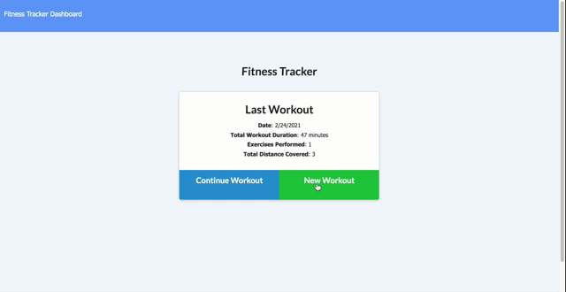

# Workout Tracker

## Link to deployed app
[Workout tracker app](https://i-workout-55.herokuapp.com/) 
## Description
Full-stack application which allows users to enter either a cardio or resistance workout and see their data from the past seven days displayed visually. Technologies: MongoDB, Node.js, Express.js.
## Installation
Install MongoDB and run `npm i` on your local machine to install dependencies. 
## License
Licensed under the [WTFPL](http://www.wtfpl.net/about/) license.